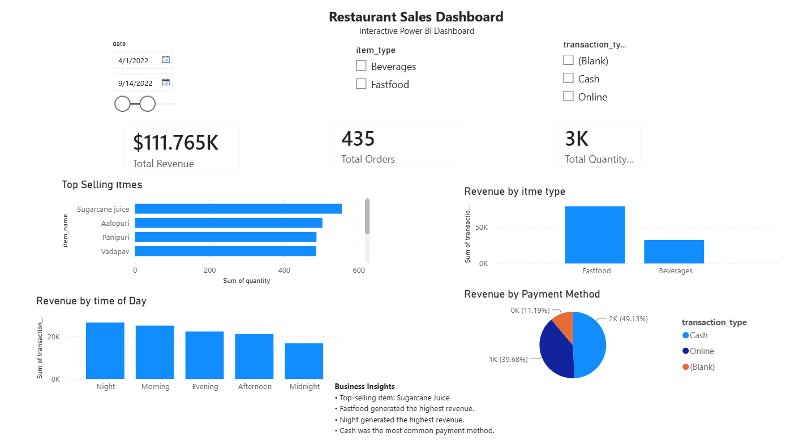

# Restaurant Sales Dashboard

I built this Power BI dashboard as part of my data analytics portfolio to practice transforming raw sales data into clear business insights.

This project focuses on restaurant sales performance, including revenue, order volume, product performance, sales by time of day, and payment method trends.

## Project Objective

The main goal of this project was to create an interactive dashboard that helps answer practical business questions such as:

- Which items are selling the most?
- Which product category generates the most revenue?
- What time of day brings the highest sales?
- Which payment methods are most commonly used?

## Dashboard Features

- Total Revenue KPI
- Total Orders KPI
- Total Quantity Sold KPI
- Top Selling Items
- Revenue by Product Category
- Revenue by Time of Day
- Revenue by Payment Method
- Interactive filters for date, item type, and transaction type

## Tools Used

- Power BI
- Power Query
- DAX
- Excel

## DAX Measures

```DAX
Total Revenue =
SUM('Restaurant Sales'[transaction_amount])

Total Orders =
DISTINCTCOUNT('Restaurant Sales'[order_id])

Total Quantity Sold =
SUM('Restaurant Sales'[quantity])
```

## Key Insights

- Sugarcane Juice was the top-selling item.
- Fastfood generated the highest revenue.
- Night generated the highest revenue by time of day.
- Cash was the most used payment method.

## Dashboard Preview



## Files Included

- `Restaurant_Sales_Dashboard.pbix`
- `Restaurant_Sales_Dataset.csv`
- `Dashboard_Screenshot.png`

## About Me

My name is Fourat Boujelben, and I am an MSIT candidate focused on Data Management and Analytics. I am building projects like this to strengthen my skills in business intelligence, data visualization, and analytical reporting.

LinkedIn: https://www.linkedin.com/in/fourat-boujelben  
GitHub: https://github.com/foufouboujelben
